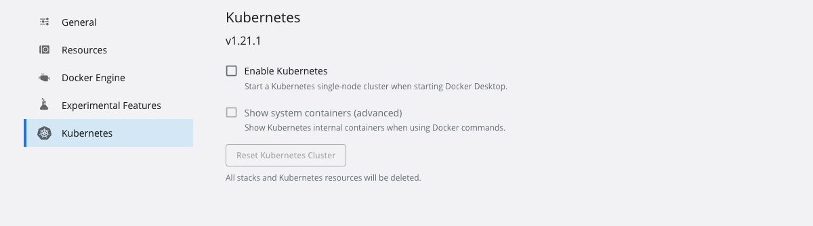
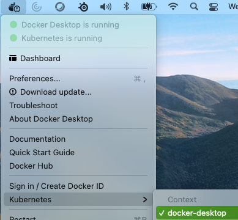
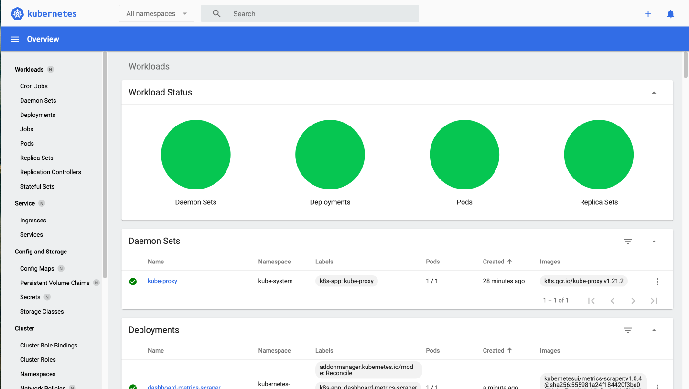
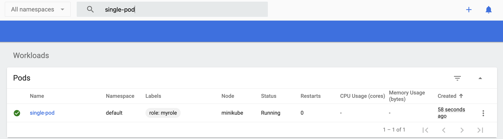

# k8-demo-1

### Install a local cluster

#### Docker desktop

Docker desktop includes the ability to run a local kubernetes cluster.

The easiest way of doing this is to go to `Docker desktop -> Preferences (the little cog in top right) -> Kubernetes -> Select Enable Kubernetes`



We can then switch to this cluster using the Docker desktop icon in the tool bar at the top



#### Kubectl

We will use kubectl to interact with out cluster, to install it run the following

```shell
brew install kubectl 
```

### Overview of dashboard

To monitor the cluster we can use a dashboard, the [Kubernetes Dashboard](https://github.com/kubernetes/dashboard) is a simple web-based UI for kubernetes.

The dashboard makes it easy and simple to monitor and troubleshoot applications running in the cluster.

Included in this tutorial is a script to get you up and running with the dashboard

```shell
./resources/start-dashboard.sh
```



The dashboard is a useful UI for your cluster and can allow you to easily make changes, view logs and manage cluster resources.

### Install/create a manifest for a published container

In this tutorial we are going to use [this docker image](https://hub.docker.com/repository/docker/fpjack/sample-app)

We will use `kubectl` to apply a YAML spec to our running cluster. These YAML specs define what we want to create

We need to ensure we are pointing at the correct cluster that we want to make changes to, running `kubectl config current-context` should return `minikube`

If this is not the case then run `kubectl config use-context minikube` to switch


Below I have put together a spec that defines a simple pod with the above image in it.

```yaml
apiVersion: v1
kind: Pod
metadata:
  name: single-pod
  labels:
    role: myrole
spec:
  containers:
    - name: server
      image: fpjack/sample-app
      ports:
        - name: web
          containerPort: 8080
          protocol: TCP
```

To apply a YAML spec to our cluster we can use `kubectl apply -f <path/to/yaml/file>`, or in this example

```shell
kubectl apply -f resources/single-pod.yaml
```

This should give you a log to say the pod was created and navigating to the dashboard should confirm this



### Port forward & View Endpoints

### View debug/output in K8 dash

### Scale out the pod

### Introduce a service/redeploy

### Node-port and port-forward the service

### Round robin visit all instances

