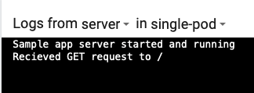
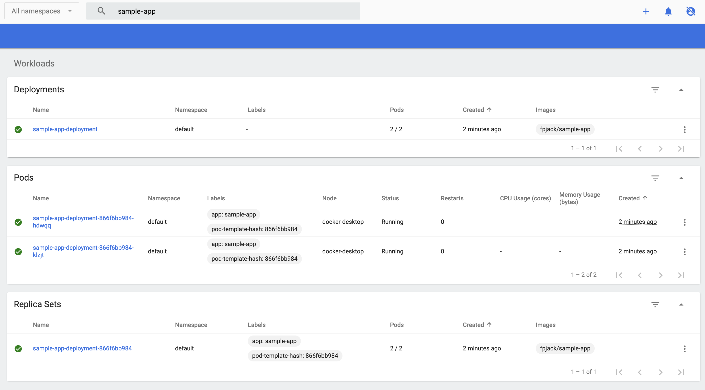

# k8-demo-1

### Install a local cluster

If Docker desktop is not an option, we can also use something called <code>minikube</code>

To install the latest minikube on macOS run either of the following

```shell
brew install minikube
```

```shell
curl -LO https://storage.googleapis.com/minikube/releases/latest/minikube-darwin-amd64
sudo install minikube-darwin-amd64 /usr/local/bin/minikube
```

Once we have minikube installed we can run `minikube start` to start our local cluster, the following is what we expect to see

```console
➜  k8-demo-1 git:(main) ✗ minikube start
😄  minikube v1.22.0 on Darwin 11.4
✨  Using the docker driver based on user configuration
👍  Starting control plane node minikube in cluster minikube
🚜  Pulling base image ...
💾  Downloading Kubernetes v1.21.2 preload ...
    > preloaded-images-k8s-v11-v1...: 502.14 MiB / 502.14 MiB  100.00% 1.76 MiB
    > gcr.io/k8s-minikube/kicbase...: 361.09 MiB / 361.09 MiB  100.00% 1.24 MiB
🔥  Creating docker container (CPUs=2, Memory=8100MB) ...
🐳  Preparing Kubernetes v1.21.2 on Docker 20.10.7 ...
    ▪ Generating certificates and keys ...
    ▪ Booting up control plane ...
    ▪ Configuring RBAC rules ...
🔎  Verifying Kubernetes components...
    ▪ Using image gcr.io/k8s-minikube/storage-provisioner:v5
🌟  Enabled addons: storage-provisioner, default-storageclass
🏄  Done! kubectl is now configured to use "minikube" cluster and "default" namespace by default
```

##### If you are using minikube, disregard the later section to install the dashboard. minikube has support to install the dashboard using `minikube dashboard`

<details>
<summary><i> Docker Desktop alternative</i></summary>

Docker desktop includes the ability to run a local kubernetes cluster.

The easiest way of doing this is to go to `Docker desktop -> Preferences (the little cog in top right) -> Kubernetes -> Select Enable Kubernetes`


*Note this will take a few minutes depending on your connection*

We can then switch to this cluster using the Docker desktop icon in the tool bar at the top


</details>

#### Kubectl

We will use kubectl to interact with our cluster, to install it run the following

```shell
brew install kubectl 
```

<details>
<summary>If you cannot use brew</summary>

If you cannot use brew for what ever reason we can instead download the binary and use that.

First download the `kubectl` binary and make it executable

```shell
curl -LO "https://dl.k8s.io/release/$(curl -L -s https://dl.k8s.io/release/stable.txt)/bin/darwin/amd64/kubectl"
chmod +x kubectl
```

You can now run `./kubectl` to access it, if you have access to anywhere on your path then you can move this binary there and just run `kubectl`

</details>

#### Default namespace

By default, we will be in namespace `default` however we can create a new namespace and use this new namespace as out default.

With `kubectl` we can create and set a new default namespace with the following

```shell
kubectl create namespace <YOUR NAMESPACE>
kubectl config set-context --current --namespace=<YOUR NAMESPACE>
```


### Overview of dashboard

To monitor the cluster we can use a dashboard, the [Kubernetes Dashboard](https://github.com/kubernetes/dashboard) is a simple web-based UI for kubernetes.

The dashboard makes it easy and simple to monitor and troubleshoot applications running in the cluster.

Note: If you use this method instead of ```minikube dashboard```, you will have to authenticate for full access.

Included in this tutorial is a script to get you up and running with the dashboard

```shell
./resources/start-dashboard.sh
```


The dashboard is a useful UI for your cluster and can allow you to easily make changes, view logs and manage cluster resources.

### Install/create a manifest for a published container

In this tutorial we are going to use [this docker image](https://hub.docker.com/r/fpjack/sample-app)

We will use `kubectl` to apply YAML file that defines our resource to our running cluster. These YAML files define what we want to create

Below I have put together some YAML that defines a simple pod with the above image in it.

```yaml
apiVersion: v1
kind: Pod
metadata:
  name: single-pod
  labels:
    role: myrole
spec:
  containers:
    - name: server
      image: fpjack/sample-app
      ports:
        - name: web
          containerPort: 8080
          protocol: TCP
```

To apply this to our cluster we can use `kubectl apply -f <path/to/yaml/file>`, or in this example

```shell
kubectl apply -f resources/single-pod.yaml
```

This should give you a log to say the pod was created and navigating to the dashboard should confirm this


### Port forward & View Endpoints

At this point our pod is running, however we have no way to access this. What we can do is forward a local port to a pod.

Port forwarding is done as follows
```shell
kubectl port-forward <POD-NAME> <LOCAL-PORT>:<POD-PORT>
```

Try and put together the arguments for this command using `single-pod.yaml` we just used.

You will know this is correct as you should be able to navigate to `localhost:<chosen port>/` and see a simple `Hello world`

<details>
<summary>Answer</summary>
<code>kubectl port-forward single-pod 8080:8080</code>
</details>


### View debug/output in K8s dash

We can also view the output and logs of the Pod on the dashboard. To do this, navigate to the pod and select the logs button

 

From here you can view all the output from all the containers running in the pod. If you had multiple containers in a pod you could be able to select them using the drop down next to the container name.

### Scale out the pod

If we now want to scale out our Pod we wont be able to with just a Pod. We will need to set up a deployment so that our pod replicas have something to manage them.

Similar to above this is managed with a Yaml file to create our resource, so we can first delete our pod we created earlier `kubectl delete pod single-pod`

We now want to apply this YAML, this will setup a deployment, that will have 2 replicas of our sample-app

```yaml
apiVersion: apps/v1
kind: Deployment
metadata:
  name: sample-app-deployment
spec:
  replicas: 2
  selector:
    matchLabels:
      app: sample-app
  template:
    metadata:
      labels:
        app: sample-app
    spec:
      containers:
        - name: server
          image: fpjack/sample-app
          ports:
            - name: web
              containerPort: 8080
              protocol: TCP
```

```shell
kubectl apply -f resources/sample-app-deployment.yaml 
```

Now our dashboard should look something like this,



This shows us a deployment which contains a set of replicas.

An interesting thing to look at now is what happens if one of our pods is destroyed or deleted.

Try request `localhost:8080/crash` to one of the pods using the same port forwarding as above.

And also try deleting the pod as well

<details>
<summary>Answer</summary>
When the container in the pod crashes then the container is automatically restarted to bring it back to life, you can see this as the pods status switches between `Running` to `Error` and then back to `Running`

When we delete the pod then the deployment will automatically spin up another pod with our sample-app, this is because in our replica set we told k8s that we wanted 2 of these pods.
</details>

### Introduce a service/redeploy

The issue we have now is how do we expose our application. We have multiple instances of our server running in different pods.

A service is going to handle all of this basic networking. It is going to allow communication inside our cluster as well as a way of targeting our pods externally depending on what type of service we create.

```yaml
apiVersion: v1
kind: Service
metadata:
  name: sample-app-service
spec:
  selector:
    app: sample-app
  ports:
    - protocol: TCP
      port: 8080
      targetPort: 8080
```

```shell
kubectl apply -f resources/service.yaml
```

This service essentially says we want to target any pods with the `app=sample-app` label

Our service is given a cluster IP and a DNS record, this is useful as we can now allow apps in our cluster to talk to one another. Previously we couldn't do this with our pods as they could easily be destroyed and recreated and assigned a different IP.


### Node-port and port-forward the service

Node porting our service is what is going to allow us to access the service externally. Therefore, we need to change the type of service from `ClusterIP` to `NodePort`

We can do this by modifying our `service.yaml` as is shown below with the new `type` and reapplying it using the same `kubectl` command as before.

```yaml
apiVersion: v1
kind: Service
metadata:
  name: sample-app-service
spec:
  type: NodePort
  selector:
    app: sample-app
  ports:
    - protocol: TCP
      port: 8080
      targetPort: 8080
```

We will now be able to see on the dashboard that our service is of type `NodePort`, we can use a `kubectl get` to find out what port we can access the service on now

```shell
kubectl get service sample-app-service --output='jsonpath="{.spec.ports[0].nodePort}"'
```

You also need to forward the port for the service. This differs slightly from forwarding a pod, as you can see below.

```shell
kubectl port-forward svc/<SERVICE-NAME> <SERVICE-PORT>:<NODE-PORT>
```

### Round robin visit all instances

Something really important when working with multiple instances of the same app behind a service is state. The sample-app can be sent a POST request to `/message` to set an in memory message that is then returned with a GET to `/message`

Try sending this POST request to our app once on our port we retrieved earlier

```shell
curl -X POST -H "Content-Type: application/json" -d '{"message": "our new message"}' http://localhost:<YOUR PORT>/message
```

Then get the message a few times, what happens?

```shell
curl -X GET http://localhost:<YOUR PORT>/message
```

<details>
<summary>Answer</summary>
The message should change between an initial message and the one you set in your POST request. This is because as your request is hitting the service it is routing between all of Pods that match the selector in the service. I.e the `app=sample-app` label

Therefore, care should be taken as to ensure our applications can handle state with this.
</details>
